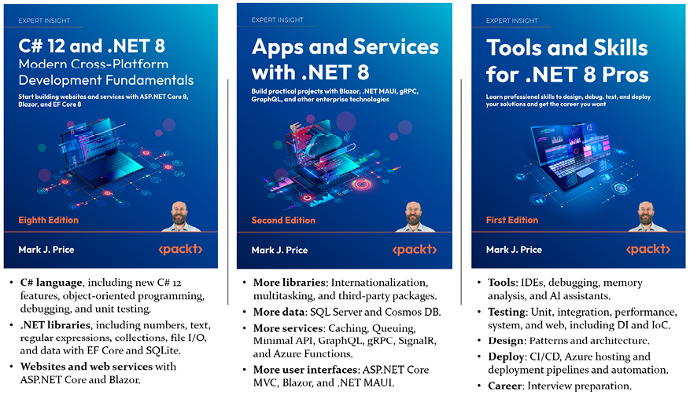
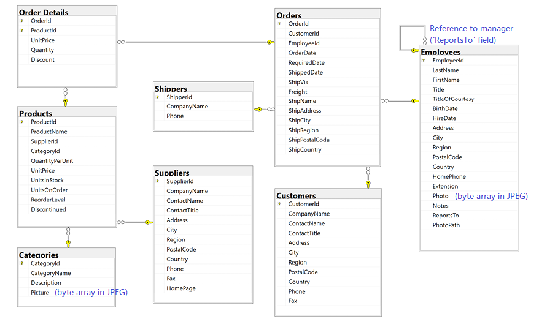
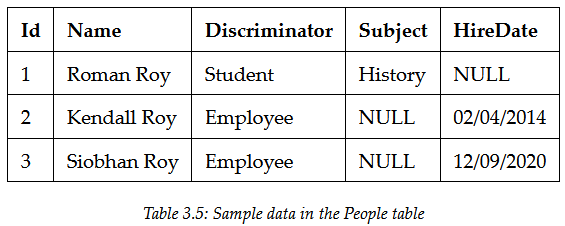
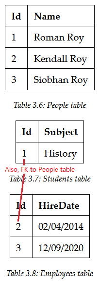
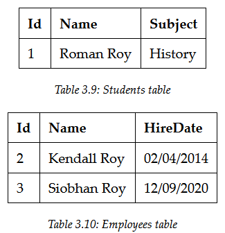

# Apps and Services with .NET 8

# Preface

## What this book covers

### Introduction

- Chapter 1, Introducing Apps and Services with .NET
- **Online-only** section covers:
  - **Benchmark** the performance.
  - Work with types for **reflection** and **attributes**, **expression trees**, and **dynamically generating source code** during compilation process.

### Data (SQL Server-centric)

- Chapter 2, Managing **Relational** Data Using **SQL Server**
  - **SQL Database** is the SQL Server in **Azure**.
  - Learn how to read and write at **low level** using **ADO.NET** for **maximum performance**
  - Then, the ORM named **Dapper** for **ease of development**.
- Chapter 3, Building **Entity Models** for SQL Server Using **EF Core**
  - Using the **higher-level** ORM named **Entity Framework Core (EF Core)**.
- Chapter 4, Managing **NoSQL** Data Using **Azure Cosmos DB**
  - **Online-only** section covers the **graph-based Gremlin API**.

### Libraries (Built-in & third-party)

- Chapter 5, **Multitasking** and **Concurrency**
  - To allow **multiple actions** to occur at the same time by using **threads** and **tasks**.
- Chapter 6, Implementing Popular **Third-Party Libraries**

  - To perform common practical tasks.

  | Library          | Purpose                           |
  | ---------------- | --------------------------------- |
  | Humanizer        | **Formatting** text and numbers.  |
  | ImageSharp       | Manipulating images.              |
  | Serilog          | Logging.                          |
  | AutoMapper       | Mapping objects to other objects. |
  | FluentValidation | Validating data.                  |
  | QuestPDF         | Generating PDFs.                  |

- Chapter 7, Handling **Dates**, **Times**, and **Internationalization**
  - **Noda Time** - Third-party library that supplement the built-in date and time types.

### Services (Backend)

- Chapter 8, Building and Securing Web Services Using **Minimal APIs**
  - The **simplest** way to build web services (**no controller**).
  - Learn how to **improve startup** time and **resources** using native **AOT publish**.
  - Learn how to **protect** and **secure** a **web service**:
    - Rate limiting
    - CORS
    - Authentication and authorization
  - **Test a web service** using the **HTTP editor** in **Visual Studio 2022**, and the **REST Client** extension for **Visual Studio Code**.
  - **Online-only** section covers building services that **quickly expose data models (e.g. EF Core)** using **Open Data Protocol (OData)**.
- Chapter 9, Caching, Queuing, and Resilient Background Services
  - **Adding features to services** that improve **scalability** and **reliability** like **caching** and **queuing**.
  - Learn how to handle **transient problems**.
  - Implement **long-running services** using **background services**.
- Chapter 10, Building **Serverless Nanoservices** Using **Azure Functions**
  - Azure Functions are typically triggered by an activity like:
    - A message sent to a queue.
    - A file uploaded to storage.
    - At a scheduled interval.
- Chapter 11, **Broadcasting** Real-Time Communication Using **SignalR**
  - **Use cases:** notification systems, dashboards (e.g. stock prices)
- Chapter 12, Combining Data Sources Using **GraphQL**
  - Building services that provide a **single endpoint** for **exposing data from multiple sources**.
  - Using the **ChilliCream GraphQL platform** (includes **Hot Chocolate**).
- Chapter 13, Building Efficient Microservices Using **gPRC**
  - Learn about the **`.proto` file format** for defining **service contracts**, and the **Protobuf binary format** for message **serialization**.
  - Learn how to **enable web browsers** to call gRPC services using **gRPC JSON transcoding**.
  - Handling **custom data types** including non-supported types like decimal.
  - Implementing interceptors.
  - Handling faults.

### Apps (Frontend)

- Chapter 14, Building **Web User Interfaces** Using **ASP.NET Core MVC**
  - Razor syntax, tag helpers, and Bootstrap.
- Chapter 15, Building **Web Components** Using **Blazor**
  - Learn how to perform **JavaScript interop** to interact with **browser features** like local storage.
- Chapter 16, Building **Mobile** and **Desktop Apps** Using **.NET MAUI**

### Conclusion

- **Online-only** section introducing the **Survey Project Challenge**.

# 1 Introducing Apps and Services with .NET

- GitHub repo: https://github.com/markjprice/apps-services-net8/
  - Can press the . (dot) key or change `.com` to `.dev` to enter a **live code editor** (based on Visual Studio Code).

## Introducing this books and its contents

### Companion books to continue your learning journey



### What you will learn in this book

- Four parts:
  1. Managing **data**
  2. Specialized **libraries** - Can be treated like a **cookbook**, and can read them in any order.
  3. **Service** technologies
  4. **User interface** technologies

### Project naming and port numbering conventions

- Use a **overall name** for the **solution**.
- Use the **type of project** as part of the project name.
- Example naming conventions:

  - Northwind is a fictional company name.

  | Name                              | Type                            | Description                                                                            |
  | --------------------------------- | ------------------------------- | -------------------------------------------------------------------------------------- |
  | `Northwind.Common`                | Class library                   | For **common types**, used across multiple projects.                                   |
  | `Northwind.Common.EntityModels`   | Class library                   | For common **EF Core entity models**.                                                  |
  | `Northwind.Common.DataContext`    | Class library                   | For the EF Core database context **with dependencies on specific database providers**. |
  | `Northwind.Mvc`                   | ASP.NET Core MVC                | For a complex **website** that can be more **easily unit tested**.                     |
  | `Northwind.WebApi.Service`        | ASP.NET Core                    | For an **HTTP API service**. A good choice for **integrating with websites**.          |
  | `Northwind.WebApi.Client.Console` | Console app                     | A client to a web service.                                                             |
  | `Northwind.gRPC.Service`          | ASP.NET Core                    | For a gRPC service.                                                                    |
  | `Northwind.gRPC.Client.Mvc`       | ASP.NET Core MVC                | A client to a gRPC service.                                                            |
  | `Northwind.BlazorWasm.Client`     | ASP.NET Core Blazor WebAssembly | Client-side Blazor project.                                                            |
  | `Northwind.BlazorWasm.Server`     | ASP.NET Core Blazor WebAssembly | Server-side Blazor project.                                                            |
  | `Northwind.BlazorWasm.Shared`     | Class library                   | Used by client- and server-side Blazor projects.                                       |

### Treating warnings as errors

- Compiler **warnings** are **potential problems**.
- **Ignoring warning** encourages **poor** development **practices**.
- Can configure a **project setting** to be forced to fix warnings.

  ```csharp
  // .csproj
  <Project Sdk="Microsoft.NET.Sdk">
    <PropertyGroup>
      <OutputType>Exe</OutputType>
      <TargetFramework>net8.0</TargetFramework>
      <ImplicitUsings>enable</ImplicitUsings>
      <Nullable>enable</Nullable>
      <TreatWarningsAsErrors>true</TreatWarningsAsErrors>  // <--
    </PropertyGroup>
  // ...
  ```

- **Good practice:** **Always** treat warnings as errors (**except for gRPC projects** until Google updates their code generation tools).
- Learn more at https://learn.microsoft.com/en-us/dotnet/csharp/language-reference/compiler-options/errors-warnings#warningsaserrors-and-warningsnotaserrors

## App and service technologies

- Microsoft calls platforms for building:
  - Applications - App models
  - Services - Workloads

### Building websites and apps using ASP.NET Core

- Technologies for building websites:

  | Technology               | Description                                                                         |
  | ------------------------ | ----------------------------------------------------------------------------------- |
  | ASP.NET Core Razor Pages | For **simple** websites.                                                            |
  | ASP.NET Core MVC         | Popular for developing **complex** websites.                                        |
  | Razor class libraries    | **Package** reusable functionality (e.g. UI components) for ASP.NET Core projects.  |
  | Blazor                   | To build UI components (WebAssembly) using C# and .NET instead of using JavaScript. |

- Note: Blazor can also be used to create **hybrid mobile and desktop apps** when combined with **.NET MAUI**.

### Building web and other services

- Services are sometimes described based on their complexity:

  | Type         | Description                                                                                                                             |
  | ------------ | --------------------------------------------------------------------------------------------------------------------------------------- |
  | Service      | - All functionality in one monolithic service.                                                                                          |
  | Microservice | - Multiple services that each focus on smaller set of functionalities, and each should own its own data.                                |
  | Nanoservice  | - Function as a service.<br />- **Often inactive** until called upon to reduce resources and costs.<br />- Aka **serverless** services. |

### Windows Communication Foundation (WCF)

- **Abstracts the business logic from the communication technology infrastructure** so that you could switch to an alternative or even have multiple mechanisms to communicate with the service.
- Uses XML configuration to declaratively define endpoints.
- Community-owned OSS project - **CoreWCF**
  - It can never be a full port since parts of WCF are Windows-specific.
- Technologies like WCF allow for building of **distributed applications**.
  - Alternative RPC technology - **gRPC**

### Common service principles

- To make method calls **chunky** instead of chatty (bundle all the data needed for an operation in a single call).
- The **overhead of a remote call** is one of the biggest **negative effects** of services.
- Having **smaller services** can **hugely negatively impact** a solution architecture.

### Summary of choices for services

- Each service technology has its **pros** and **cons** based on its **feature support**:

  | Feature                                         | Web API     | OData       | GraphQL               | gRPC    | SignalR   |
  | ----------------------------------------------- | ----------- | ----------- | --------------------- | ------- | --------- |
  | Clients can request **just the data they need** | No          | Yes         | Yes                   | No      | No        |
  | Minimum HTTP version                            | 1.1         | 1.1         | 1.1                   | **2.0** | 1.1       |
  | Browser support                                 | Yes         | Yes         | Yes                   | No      | Yes       |
  | **Data** format                                 | XML, JSON   | XML, JSON   | GraphQL (**JSONish**) | Binary  | Varies    |
  | Service **documentation**                       | Swagger     | Swagger     | No                    | No      | No        |
  | Code generation                                 | Third-party | Third-party | Third-party           | Google  | Microsoft |
  | Caching                                         | Easy        | Easy        | Hard                  | Hard    | Hard      |

- Recommendations for various scenarios:

  | Scenario                                      | Recommendation                                                                                                                                                                                                     |
  | --------------------------------------------- | ------------------------------------------------------------------------------------------------------------------------------------------------------------------------------------------------------------------ |
  | **Public** service                            | - HTTP/**1.1**-based services.<br />- Clients: browser, mobile                                                                                                                                                     |
  | **Public data** service                       | - **OData**, **GraphQL** - Good choices for exposing **complex datasets** (e.g. come from different data stores).                                                                                                  |
  | Service-to-service                            | - **gRPC** - Low-latency, high-throughput.<br />- Great for lightweight internal **microservices**.                                                                                                                |
  | **Point-to-point** real-time communication    | - **gRPC** - Support for **bidirectional streaming**. Can **push** messages in real time **without polling**.<br />- **SignalR** - General real-time solution. **Easier** to implement than gRPC (less efficient). |
  | **Broadcast** real-time communication         | - **SignalR** - Great support for broadcasting.                                                                                                                                                                    |
  | **Polyglot** environment                      | - **gRPC** - Tooling supports all popular languages.                                                                                                                                                               |
  | **Network-bandwidth-constrained** environment | - **gRPC** - Lightweight message format (Protobuf).                                                                                                                                                                |
  | Serverless nanoservice                        | - **Azure Functions** - Good choice for services that **don't need to be running constantly**.                                                                                                                     |

## Setting up your development environment

### Keyboard shortcuts

- [Visual Studio](appendices/visual-studio-keyboard-shortcuts.pdf) (Can be configured to use vscode keyboard mapping scheme)
- [vscode](appendices/vscode-keyboard-shortcuts.pdf)
- [SSMS](appendices/ssms-keyboard-shortcuts.pdf)

### Consuming Azure resources

- Azure resources to use and their local development alternative:

  | Azure resource        | Local development alternative                                                                      |
  | --------------------- | -------------------------------------------------------------------------------------------------- |
  | SQL Database          | - SQL Server Developer Edition on Windows.<br />- SQL Edge in a Docker container (cross-platform). |
  | Cosmos DB database    | Azure Cosmos DB emulator.                                                                          |
  | Azure functions       | Azurite open-source emulator.                                                                      |
  | Azure SignalR Service | Add SignalR to any ASP.NET Core project.                                                           |

## Benchmarking Performance and Testing

### Monitoring performance and memory resource usage using built-in types

- Before improving the performance of any code, we should monitor its speed to record a **baseline**.

#### Evaluating the efficiency of types

- Factors to determine the best types to use:
  - Functionality
  - Memory size
  - Performance
  - Future needs
- `sizeof()` shows the number of bytes that a single instance (primitive types) uses.

#### Monitor performance and memory using diagnostics

- `System.Diagnostics` namespace

#### Useful members of the `Stopwatch` and `Process` types

- `Stopwatch` type:

  | Member                         | Description                                                  |
  | ------------------------------ | ------------------------------------------------------------ |
  | `Restart` method               | Resets the elapsed time and starts the timer.                |
  | `Stop` method                  | Stops the timer.                                             |
  | `Elapsed` property             | Elapsed time stored as a `TimeSpan`.                         |
  | `ElapsedMilliseconds` property | Elapsed time **in milliseconds** stored as an `Int64` value. |

- `Process` type:

  | Member                | Description                                                      |
  | --------------------- | ---------------------------------------------------------------- |
  | `VirtualMemorySize64` | Displays the amount of **virtual memory**, in bytes, allocated.  |
  | `WorkingSet64`        | Displays the amount of **physical memory**, in bytes, allocated. |

#### Implementing a `Recorder` class (Utils)

- To monitor time and memory resource usage.

#### Measuring the efficiency of processing strings

- To evaluate the best way to process `string` variables.
- **Good Practice:** Avoid using the `String.Concat` method or the `+` operator inside loops. Use `StringBuilder` instead.

### Monitoring performance and memory using `Benchmark.NET`

#### Building a console app with `Benchmark.NET`

- Define a class with **methods** for each benchmark.
- `Important:` Must build in a **Release** build for performance testing, as most optimizations are disabled in **Debug** builds.

## Observing and Modifying Code Execution Dynamically

- About **types** for:
  - Performing **code reflection** and **applying and reading attributes**
  - Working with **expression trees**
  - Creating **source generators**

### Using an analyzer to write better code - StyleCop

- Steps to setup StyleCop:

  1. Add the `StyleCop.Analyzers` package reference.
  2. Add a `stylecop.json` for configuring StyleCop settings.

     ```json
     {
       "$schema": "https://raw.githubusercontent.com/DotNetAnalyzers/StyleCopAnalyzers/master/StyleCop.Analyzers/StyleCop.Analyzers/Settings/stylecop.schema.json",
       "settings": {}
     }
     ```

  3. In the `.csproj`, configure the `stylecop.json`:
     - To **not be included** in published **deployments**.
     - To **enable it** as an additional file **for processing during development**.

#### Suppressing warnings

- Three ways:

  1. Setting an **assembly-level attribute**

     ```cs
     // GlobalSuppressions.cs

     [assembly: SuppressMessage("StyleCop.CSharp.OrderingRules", "SA1200:UsingDirectivesMustBePlacedWithinNamespace", Justification = "Reviewed.")]
     ```

  2. Using `#pragma` statements

     ```cs
     #pragma warning disable SA1200
     using System.Diagnostics;
     #pragma warning restore SA1200
     ```

  3. Add a configuration option in `stylecop.json`

     ```json
     {
       "$schema": "https://raw.githubusercontent.com/DotNetAnalyzers/StyleCopAnalyzers/master/StyleCop.Analyzers/StyleCop.Analyzers/Settings/stylecop.schema.json",
       "settings": {
         "orderingRules": {
           "usingDirectivesPlacement": "outsideNamespace"
         }
       }
     }
     ```

#### Fixing the code

- **Project property** for generating an **XML file for documentation**.

  - The XML file can then be processed by a tool like **DocFX** to convert it into documentation files.
  - Reference: [DocFX guide](https://www.jamescroft.co.uk/building-net-project-docs-with-docfx-on-github-pages/)

  ```xml
  <!-- .csproj -->
  <PropertyGroup>
    ...
    <GenerateDocumentationFile>true</GenerateDocumentationFile>
  </PropertyGroup>
  ```

#### Understanding common StyleCop recommendations

- Order inside a code file:

  1. External alias directives
  2. Using directives
  3. Namespaces
  4. Delegates
  5. Enums
  6. Interfaces
  7. Structs
  8. Classes

- Order within a class:

  1. Fields
  2. Constructors
  3. Destructors (finalizers)
  4. Delegates
  5. Events
  6. Enums
  7. Interfaces
  8. Properties
  9. Indexers
  10. Methods
  11. Structs
  12. Nested classes and records

- Reference: [StyleCop rules](https://github.com/DotNetAnalyzers/StyleCopAnalyzers/blob/master/DOCUMENTATION.md)

### Working with reflection and attributes

- **Reflection** is a feature that allows code to **manipulate itself**.
- **Assembly** is made up of four parts:
  1. Assembly metadata - Name, file version, referenced assemblies
  2. Type metadata
  3. IL code
  4. Embedded resources (optional) - Images, Javascript
- **Attributes** can be applied at multiple levels:

  ```cs
  // an assembly-level attribute
  [assembly: AssemblyTitle("Working with reflection and attributes")]

  // a type-level attribute
  [Serializable]
  public class Person
  {
    // a member-level attribute
    [Obsolete("Deprecated: use Run instead.")]
    public void Walk()
    {
  ...
  ```

#### Creating custom attributes

- By **inheriting** from the `Attribute` class.
- To **decorate** others classes and methods.
- Provides **metadata** for **reflection-based logic**.
- [Code References](Chapter01/WorkingWithReflection/CoderAttribute.cs)

### Making a type or member obsolete - `[Obsolete]`

- When you want to refactor your types and members while maintaining **backward compatibility**.

### Dynamically loading assemblies and executing methods

- When not knowing the assemblies that you need to call until runtime.
- **Use cases:**
  - An assembly that is only loaded into memory when it is **activated** by the user.
  - **Custom plugins** implementation.
- Can dynamically load assemblies into an `AssemblyLoadContext`.
- **Is collectible** means the assemblies can be **removed from memory**.

#### Doing more with reflection

- [Inspect assembly contents using `MetadataLoadContext`](https://docs.microsoft.com/en-us/dotnet/standard/assembly/inspect-contents-using-metadataloadcontext)
- [Dynamically generate new code and assemblies](https://docs.microsoft.com/en-us/dotnet/api/system.reflection.emit.assemblybuilder)

### Working with expression trees

- **Represent code as a structure** that you can examine or execute.
- Expression trees are **immutable**.
- Also used to represent an expression in an **abstract** way, allowing that data structure to be expressed in other ways, using other languages (e.g. LINQ to entities).

#### Understanding components of expression trees - `System.Linq.Expressions`

- Types for representing the components of an expression tree:

  | Type                    | Description                                                                      |
  | ----------------------- | -------------------------------------------------------------------------------- |
  | `BinaryExpression`      | Expression with **binary operator**.                                             |
  | `BlockExpression`       | A block containing **a sequence of expressions** where variables can be defined. |
  | `CatchBlock`            | A **catch statement** in a try block.                                            |
  | `ConditionalExpression` | Expression that has a **conditional operator**.                                  |
  | \*`LambdaExpression`    | A lambda expression. **(Only this can be executed)**                             |
  | `MemberAssignment`      | **Assigning** to a field or property.                                            |
  | `MemberExpression`      | **Accessing** a field or property.                                               |
  | `MethodCallExpression`  | A call to a **method**.                                                          |
  | `NewExpression`         | A call to a **constructor**.                                                     |

#### Executing the simplest expression tree

- [Code References](Chapter01/WorkingWithExpressionTrees/Program.cs)

### Create source generators

- Dynamically generate and compile code files.
- [`System.Text.Json` source generator](https://devblogs.microsoft.com/dotnet/try-the-new-system-text-json-source-generator/)
  - **By default**, serializing JSON uses **reflection** at runtime to dynamically analyze an object model, but this is **slow**.
- Source generators must target **.NET Standard 2.0**.

# 2 Managing Relational Data Using SQL Server

## Understanding modern databases

- Use **Azure SQL Database** or **Azure SQL Edge** (can run in a Docker container) for **cross-platform development**.

### Using a simple relational database

- Northwind database **tables** and **relationships**:

  

### Connecting to a SQL Server database - Connection string

- Information needed to connect to a SQL Server database:
  - **Server name** - Can include the protocol, IP address, and port number.
  - **Database name**
  - **Security info** - username and password, or Windows Authentication
- **Connection string's keywords for parameters**:

  - Multiple possible keywords is for **backward compatibility**.

  | Keywords                      | Description                                                                                                                                                                                    |
  | ----------------------------- | ---------------------------------------------------------------------------------------------------------------------------------------------------------------------------------------------- |
  | `Data Source`/`server`/`addr` | - Server name.<br />- Can use `.` to mean the **local server**.                                                                                                                                |
  | `Initial Catalog`/`database`  | - Initial database name.<br />- A SQL statement could change that using the `USE <database_name>`.                                                                                             |
  | `User Id` and `Password`      | - For authentication.<br />- Important for Azure SQL Database or Azure SQL Edge because they **do not support Windows Authentication**.                                                        |
  | `Authentication`              | - To authenticate by using **Azure AD** that can enable **password-less authentication**.<br />- Values can be `Active Directory Integrated`, `Active Directory Password`, and `Sql Password`. |
  | `Persist Security Info`       | - `false` - To Remove the `Password` from the connection string **after authenticating**.                                                                                                      |
  | `Encrypt`                     | - `true` - To use SSL to encrypt transmissions.                                                                                                                                                |
  | `TrustServerCertificate`      | - Set to `true` if **hosting locally** and get the cert error.                                                                                                                                 |
  | `Connection Timeout`          | Defaults to **30 seconds**.                                                                                                                                                                    |
  | `MultipleActiveResultSets`    | - `true` - To enable a **single connection** to work with **multiple tables simultaneously** to improve efficiency. It is used for **lazy loading** rows from related tables.                  |

- **Server name** depends on the edition and version of SQL Server:

  | SQL Server edition                | Server name \ Instance name                          |
  | --------------------------------- | ---------------------------------------------------- |
  | LocalDB 2012                      | `(localdb)\v11.0`                                    |
  | LocalDB 2016 or later             | `(localdb)\mssqllocaldb`                             |
  | Express                           | `.\sqlexpress`                                       |
  | Full/Developer (default instance) | `.`                                                  |
  | Full/Developer (named instance)   | `.\apps-services-book`                               |
  | Azure SQL Edge (local Docker)     | `tcp:127.0.0.1,1433`                                 |
  | Azure SQL Database                | `tcp:[custom server name].database.windows.net,1433` |

- **Good Practice:**
  - Use `.` for the **localhost**.
  - **Server name** can be made up of two parts:
    1. Computer name
    2. SQL Server instance name (Can be provided during **custom installation**)

## Managing data with Transact-SQL (T-SQL)

- **Text data** can be treated as **case-sensitive or not, depending on the configuration**.
- Reference: [T-SQL](https://learn.microsoft.com/en-us/sql/t-sql/language-reference)

### T-SQL data types

- Used for **columns**, **variables**, and **parameters**:

  | Category      | Examples                                                                                                    |
  | ------------- | ----------------------------------------------------------------------------------------------------------- |
  | Numbers       | `bigint`, `bit`, `decimal`, `float`, `int`, `money`, `numeric`, `real`, `smallint`, `smallmoney`, `tinyint` |
  | Date and time | `date`, `datetime2`, `datetime`, `datetimeoffset`, `smalldatetime`, `time`                                  |
  | Text          | `char`, `nchar`, `ntext`, `nvarchar`, `text`, `varchar`                                                     |
  | Binary        | `binary`, `image`, `varbinary`                                                                              |
  | Other         | `cursor`, `hierarchyid`, `sql_variant`, `table`, `rowversion`, `uniqueidentifier`, `xml`                    |

- **Note:** No JSON data type. Use `nvarchar` to store JSON values.

### Declaring variables

- **Local variables** are prefixed with `@`, and defined using `SET`, `SELECT`, or `DECLARE`:

  ```sql
  DECLARE @WholeNumber INT; -- Must declare a variable first.
  SET @WholeNumber = 3;
  SET @WholeNumber = @WholeNumber + 1;
  SELECT @WholeNumber = COUNT(*) FROM Employees;
  SELECT @WholeNumber = EmployeeId FROM Employees WHERE FirstName = 'Janet';
  ```

- **Global variables** are prefixed with `@@`, such as `@@ROWCOUNT`.

### Specifying data types

- Most types has a **fixed size**.
- For **text** and **binary** types, you can **prefixed with** `var` or `nvar` (variable size), which will **change its size** based on its current value.
- For **text** types, `n` prefix (Unicode) will use **two bytes** per character.

### Controlling flow

- **Similar** flow control keywords as C# - `BREAK`, `CONTINUE`, `GOTO`, `IF...ELSE`, `CASE`, `THROW`, `TRY...CATCH`, `WHILE`, and `RETURN`.
- Main **difference** - `BEGIN` and `END`, the equivalent of **curly braces** in C#.

### Operators

- LINQ-like operators - `ANY`, `ALL`, `SOME`, `EXISTS`, `BETWEEN`, and `IN`.
- Text pattern matching - `LIKE`
  - `%` - Match **any number** of characters.
  - `_` - Match a **single** character.
  - `[]` - Match a **range** and **set** of allowed characters.
    - E.g. `[0-9A-Z.-,]`
    - Looks like a regex but **it is not**.

### Data Manipulation Language (DML)

- To query and change data.
- Reference: [`SELECT`](https://learn.microsoft.com/en-us/sql/t-sql/queries/select-transact-sql)

### Data Definition Language (DDL)

- Change the **structure** of the database, including creating new objects like **tables**, **functions**, and **stored procedures**.

  | Example                                                                                                   | Description                                                                                               |
  | --------------------------------------------------------------------------------------------------------- | --------------------------------------------------------------------------------------------------------- |
  | `CREATE INDEX IX_FullName`<br />`ON Employees(LastName, FirstName DESC)`<br />`WITH (DROP_EXISTING = ON)` | - Change an **aggregate index** (multiple key columns).<br />- **Key column** is for seeking and sorting. |
  | `DROP TABLE IF EXISTS Employees`                                                                          | - Avoid the error when the `Employees` table doesn't exist.                                               |
  | `IF OBJECT_ID(N'Employees', N'U') IS NOT NULL`                                                            | - Check if a table exists.<br />- `U` means a **user table**.                                             |

## Managing data with low-level APIs - `ADO.NET`

- `Microsoft.Data.SqlClient` package

### Understanding the types in ADO.NET

- **Abstract types** - `DbConnection`, `DbCommand`, and `DbDataReader`.
  - Database providers can **inherit** from and provide specific implementations.
- Most important **types** with their most used **members** for SQL Server:

  | Type                         | Properties                                                                             | Methods                                                                                  |
  | ---------------------------- | -------------------------------------------------------------------------------------- | ---------------------------------------------------------------------------------------- |
  | `SqlConnection`              | `ConnectionString`, `State`, `ServerVersion`                                           | `Open`, `Close`, `CreateCommand`, `RetrieveStatistics`                                   |
  | `SqlConnectionStringBuilder` | `InitialCatalog`, `DataSource`, `Encrypt`, `UserID`, `Password`, `ConnectionTimeout`   | `Clear`, `ContainsKey`, `Remove`                                                         |
  | `SqlCommand`                 | `Connection`, `CommandType`, `CommandText`, `Parameters`, `Transaction`                | `ExecuteReader`, `ExecuteNonQuery`, `ExecuteXmlReader`, `CreateParameter`                |
  | `SqlParameter`               | `ParameterName`, `Value`, `DbType`, `SqlValue`, `SqlDbType`, `Direction`, `IsNullable` |                                                                                          |
  | `SqlDataReader`              | `FieldCount`, `HasRows`, `IsClosed`, `RecordsAffected`                                 | `Read`, `Close`, `GetOrdinal`, `GetInt32`, `GetString`, `GetDecimal`, `GetFieldValue<T>` |

- `SqlConnection` has two **useful events** - `StateChange` and `InfoMessage`.

### Outputting statistics

- **ADO.NET connection** can track useful statistics during its lifetime.

  | Key                                                            | Description                                                                         |
  | -------------------------------------------------------------- | ----------------------------------------------------------------------------------- |
  | `BuffersReceived`, `BuffersSent`, `BytesReceived`, `BytesSent` | Data is transmitted as bytes **stored in buffers**.                                 |
  | `CursorOpens`                                                  | Cursors are **expensive** (require state on the server), and should be **avoided**. |
  | `Prepares`, `PreparedExecs`, `UnpreparedExecs`                 | prepares = compilations                                                             |
  | `SelectCount`, `SelectRows`                                    | Number of `SELECT` statements and rows.                                             |
  | `ServerRoundtrips` `SumResultSets`, `Transactions`             |                                                                                     |
  | `ConnectionTime`, `ExecutionTime`, `NetworkServerTime`         | Time in milliseconds spent.                                                         |

### Executing stored procedures using ADO.NET

- **Stored procedure** is best for executing the same query multiple times because it can be **precompiled** and **optimized**.
- **Direction** of stored procedure **parameters**:
  - Input
  - Output
  - Return values
- `PRINT` command raises the `InfoMessage` event.

### Generating objects with a data reader

- ADO.NET **does not have a built-in ability to map a data reader row to an object**, so we have to do it **manually**.
- **Good Practice:** For read-only instances (immutable), use `record` type.

## Managing data with Dapper

- Dapper extends the `IDbConnection` interface with very basic functionality.

### Dapper connection extension methods

- Three extension methods to `IDbConnection`:
  1. \*`Query<T>`
     - The most used.
     - By default, it **buffers the entire reader (all rows)** on return. With **large datasets**, you can **minimize memory** and only load objects as needed by setting `buffered` to `false`.
  2. `Query`
  3. `Execute`
- Dapper **automatically open and close the associated connection** as needed.

### Querying using Dapper

- When using **stored procedures** to query:
  - Must pass a `param` object with **all parameters**.
  - Must explicitly set the **command type** to stored procedure.
- Reference: [Dapper](https://github.com/DapperLib/Dapper/blob/main/Readme.md)

## Alternatives for storing secrets

- Reference: [App secrets](https://learn.microsoft.com/en-us/aspnet/core/security/app-secrets)

# 3 Building Entity Models for SQL Server Using EF Core

- Three **mapping strategies** to store entity models that use **inheritance hierarchies**.

## Managing data with EF Core (ORM)

- Can **treat the data as objects** instead of rows in multiple tables.

### Understanding Entity Framework Core

- EF Core **supports** traditional RDBMSs, modern cloud-based, nonrelational, schema-less data stores, such as Azure Cosmos DB and MongoDB.
- Two approaches to working with EF Core:
  1. **Database First** - The most common scenario.
  2. **Code First**

### Scaffolding models using an existing database

- A good scaffolding tool allows you to **extend the automatically generated classes** and then **regenerate those classes without losing your extended classes**.
  - Entity class is declared using the `partial` keyword, so you can create a matching `partial` class for adding additional code.
  - Can implement the `OnModelCreatingPartial` partial method of the `partial` DbContext to extend the generated class.
- Code generated by the tool is **just the best approximation**.
- **Good Practice:** Do not be afraid to overrule a tool when you know better.

### [Defining EF Core models](https://github.com/boonyong6/csharp-12-and-dotnet-8-note?tab=readme-ov-file#defining-ef-core-models)

### Defining the Northwind database model

- Command to generate a model for all the tables:

  ```bash
  dotnet ef dbcontext scaffold "Data source=.;Initial Catalog=Northwind;Integrated Security=true;TrustServerCertificate=true;" Microsoft.EntityFrameworkCore.SqlServer --output-dir Models --namespace Northwind.Models --data-annotations --context NorthwindDb
  ```

- Classes decorated with `[Keyless]` represents a row returned by a **database view**.

  ```csharp
  // ProductsAboveAveragePrice.cs
  [Keyless]
  public partial class ProductsAboveAveragePrice
  {
      [StringLength(40)]
      public string ProductName { get; set; } = null!;

      [Column(TypeName = "money")]
      public decimal? UnitPrice { get; set; }
  }

  // NorthwindDb.cs
  //   OnModelCreating()
  modelBuilder.Entity<ProductsAboveAveragePrice>(entity =>
  {
      entity.ToView("Products Above Average Price");
  });
  ```

### [Controlling the tracking of entities](https://github.com/boonyong6/csharp-12-and-dotnet-8-note?tab=readme-ov-file#controlling-the-tracking-of-entities)

## Mapping inheritance hierarchies with EF Core

```csharp
public abstract class Person
{
    public int Id { get; set; }
    public string? Name { get; set; }
}

public class Student : Person
{
    public string? Subject { get; set; }
}

public class Employee : Person
{
    public DateTime HireDate { get; set; }
}
```

### Table-per-hierarchy (TPH) mapping strategy - Default



- Use a **single table** with a **discriminator column** to indicate the **type**.
- **Cons:**
  - Require the columns for **properties of derived types** to be **nullable**.
  - Cause an issue when **properties are required** at the **class level**.
- **Pros:**
  - Simplicity and performance.
- **Good Practice:** Define an **index on the discriminator column** when it has **many different values**.

### Table-per-type (TPT) mapping strategy



- Use a table for **every type**.
- **Pros:**
  - Reduced storage (full normalization)
- **Cons:**
  - A single entity is **spread** over multiple tables. It takes more effort to reconstruct it, which reduces overall performance.
- Usually a **POOR choice**.
  - Only use it if the table is **already normalized** and **can't be restructured**.

### Table-per-concrete-type (TPC) mapping strategy



- Use a table for each **non-abstract type**.
- **Note:** Since there's no shared table to define the `IDENTITY` column, we can use a **id sequence** to share between tables.
  - `(NEXT VALUE FOR [PersonIds])`
- **Pros:**
  - **Performance** - When querying a single concrete type, only one table is needed.
- Best for inheritance hierarchies of **many concrete types**, each with **many type-specific properties**.

### Configuring inheritance hierarchy mapping strategies

1. **All types** must be included in the DB context.

   ```csharp
   public DbSet<Person> People { get; set; }
   public DbSet<Student> Students { get; set; }
   public DbSet<Employee> Employees { get; set; }
   ```

2. In the DB context `OnModelCreating` method, call the "use mapping strategy" method **on the base class**.

   ```csharp
   modelBuilder.Entity<Person>().UseTptMappingStrategy();
   // OR
   modelBuilder.Entity<Person>().UseTpcMappingStrategy();
   ```

3. For the **TPC strategy**, configure a shared sequence.

   ```csharp
   modelBuilder.HasSequence<int>("PersonIds");
   modelBuilder.Entity<Person>().UseTpcMappingStrategy()
     .Property(e => e.Id).HasDefaultValueSql("NEXT VALUE FOR [PersonIds]");
   ```

## Building a reusable entity data model

- A **pair** of reusable class libraries:
  1. **Entity models** - Define the **entities**.
  2. **Data context** - Define the **tables** in the database and the **default configuration** for how to **connect** to the database, and use the **Fluent API** to configure additional options for the model.
- Command to scaffold entity class models:
  ```bash
  dotnet ef dbcontext scaffold "Data Source=.;Initial Catalog=Northwind;Integrated Security=true;TrustServerCertificate=True;" Microsoft.EntityFrameworkCore.SqlServer --namespace Northwind.EntityModels --data-annotations
  ```

### Calculated properties on entity creation - `IMaterializationInterceptor`

- Allows **interception** before and after an **entity is created**, and when **properties are initialized**.
- Useful for **calculated values**.

# 4 Managing NoSQL Data Using Azure Cosmos DB

- Create Cosmos DB resources using the **local emulator**.
- Working with **traditional data** using the **Core (SQL) API**.
- **Online-only** section covers working with **graph data** using the **Gremlin API**.

## Understanding NoSQL databases

### Cosmos DB and its APIs

- A NoSQL data store.
- Support multiple APIs:
  - Native API - SQL-based
  - Alternative APIs - MongoDB, Cassandra, and Gremlin.
- Store data in **atom-record-sequence (ARS)** format.
- Choose the API when creating the database:

  | API                                 | Description                                                                                                                                                                                  |
  | ----------------------------------- | -------------------------------------------------------------------------------------------------------------------------------------------------------------------------------------------- |
  | API for MongoDB                     | - Allows **existing clients** to interact with the data as if it's a real MongoDB database.<br />- Data migration tools - `mongodump`, `mongorestore`                                        |
  | API for Cassandra                   | - Allows **existing clients** to interact with the data as if it's a real Cassandra database.                                                                                                |
  | Core (SQL) API<br />(JSON Document) | - Recommended for **new projects**.<br />- Allows developers to **query JSON documents** using a language like SQL.<br />- Uses **JSON's type system** and **JavaScript's function system**. |
  | Gremlin API for Cosmos DB           | - To treat Cosmos DB as a **graph data store**. <br />- To analyze the metadata of the relationships between data items.                                                                     |

- **Good Practice:** If you are unsure which API to choose, **select Core (SQL) as the default**.

### Document modeling

- Common to **embed** related data (**denormalization**), which involves **duplicating data** (e.g. supplier, category).

  - **Embed when** the related data (bounded/unbounded) is \***not updated frequently**, and often needs to be included in query results.
  - E.g. The most liked comments on an article.

  ```json
  {
    "id": "1",
    "productId": "1",
    "productName": "Chai",
    "supplier": {
      "supplierId": 1,
      "companyName": "Exotic Liquids",
      "contactName": "Charlotte Cooper",
      "Address": "49 Gilbert St.",
      "City": "London",
      "Country": "UK",
      "Phone": "(171) 555-2222"
    },
    "category": {
      "categoryId": 1,
      "categoryName": "Beverages",
      "description": "Soft drinks, coffees, teas, beers, and ales",
      "image": "https://myaccount.blob.core.windows.net/categories/beverages.png"
    },
    "quantityPerUnit": "10 boxes x 20 bags",
    "unitPrice": 18.0,
    "unitsInStock": 39,
    "unitsOnOrder": 0,
    "reorderLevel": 10,
    "discontinued": false
  }
  ```

- Reference: [Modeling documents in Azure Cosmos DB](https://learn.microsoft.com/en-us/azure/cosmos-db/sql/modeling-data)

### Consistency levels

- Azure Cosmos DB relies on **replication** to provide **low latency** and **high availability**.
  - This comes with **tradeoffs** that you must accept and choose from.
- Best consistency - **linearizability** (**must wait for replication** to occur globally)
  - Increases the latency of write operations
  - Reduces the availability of read operations
- Most NoSQL databases offer two levels of consistency:
  1. Strong
  2. Eventual
- Azure Cosmos DB offers **five levels** of consistency (from the strongest to the weakest):

  | Consistency level | Description                                                                                                                                                                                                                                                                                                                                                                                                       |
  | ----------------- | ----------------------------------------------------------------------------------------------------------------------------------------------------------------------------------------------------------------------------------------------------------------------------------------------------------------------------------------------------------------------------------------------------------------- |
  | Strong            | - Guarantees linearizability.<br />- You probably don't want to use it in all cases, as it can slow down operations.                                                                                                                                                                                                                                                                                              |
  | Bounded staleness | - Can read your own write within the write region, monotonic read, and consistent prefix.<br />- Staleness of read data **is restricted** to a number of versions within a time interval.<br />- **E.g.** if we set the time interval to ten minutes and the number of versions to three, then a **maximum of three writes can be made in ten-minute period** before a read operation must reflect those changes. |
  | Session           | - Can read your own write within the write region, monotonic read, and consistent prefix.                                                                                                                                                                                                                                                                                                                         |
  | Consistent prefix | - **Guarantees the order** that writes can then be read.                                                                                                                                                                                                                                                                                                                                                          |
  | Eventual          | - The order of reads **may not match** the order of writes.<br />- Data will only become consistent eventually (when writes pause).<br />- Possible for a client to read data **older than** the ones it read before.                                                                                                                                                                                             |

- Reference: [Consistency levels](https://learn.microsoft.com/en-us/azure/cosmos-db/consistency-levels)

### Hierarchy of components

- **Account** - Can create up to 50 accounts.
- **Database** - E.g. `Northwind`.
- **Container** (aka collection) - E.g. `Products`.
- **Partition:**
  - Partition provisioning is managed by Azure.
  - No control over physical partition.
  - Define **partition keys** to control the logical partition.
- **Item** (generic term) - A stored entity.

  | API                            | Specific terms |
  | ------------------------------ | -------------- |
  | Core (SQL) API                 | JSON document  |
  | Cassandra                      | Row            |
  | MongoDB                        | Document       |
  | Graph databases (e.g. Gremlin) | Vertex, Edge   |

### Throughput provisioning

- Measured as **request units per second (RU/s)**.
  - **One request unit (RU)** is about the cost **a `GET` request for a 1KB document using its ID**.
- Must be provisioned **in advance**.
  - **Must estimate throughput** by calculating the number of operations to support throughout the year.
- `RequestCharge` property - Shows how much a request costs in RUs.
- **Most throughput settings** are applied at the **container level**.
  - Can also apply it at the **database level** to **share** across all containers.
  - Throughput is distributed equally among partitions.
- Once throughput is **exhausted**, Cosmos DB starts **rate-limiting** access requests, and your code have to **retry later**.
  - .NET SDK for Cosmos DB can handle the retry.

### Partition strategies

- Good strategy - Choosing a **suitable partition key**.
- Set for a **container** and **can't be changed**.
- Partition key should be **evenly distribute** operations to avoid hot partitions.
- **Good choice** - Unique field for lookup (e.g. social security number)
  - **But**, partition keys don't have to be unique. It will be **combined with an item ID** to uniquely identify an item.
